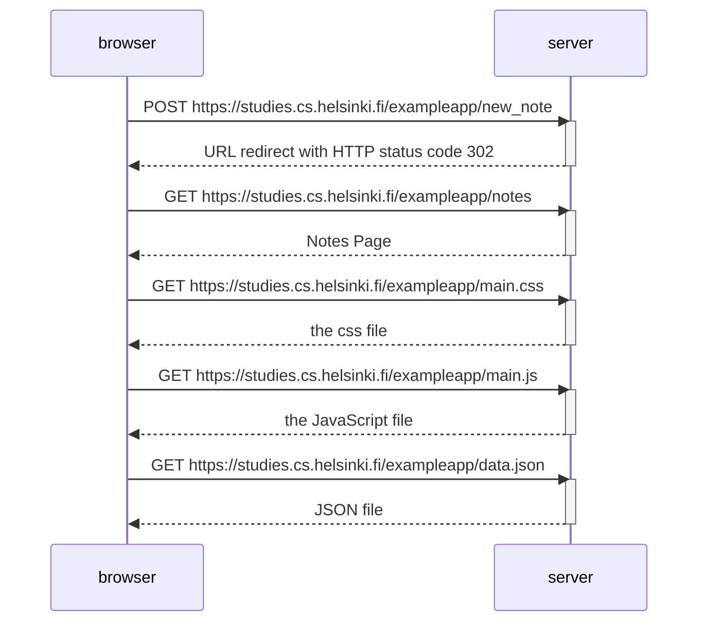

Part 0 
Exercise 0.4 
Objective: New note diagram depicting the situation where user creates a new note on the page https://studies.cs.helsinki.fi/exampleapp/notes
by writing something into the text field and clicking the submit button. 

Note creation steps:
1. Notes page contains a form element 
2. When submit button is clicked, browser sends user input to server
3. Upon submitting 6 HTTP requests are generated

HTTP requests:
1. Browser sends POST request to Server via URL https://studies.cs.helsinki.fi/exampleapp/new_note
2. Server responds with HTTP status code 302 (URL Redirect) asking Browser to do a new GET request at address defined in header's LOCATION - the address /exampleapp/notes
3. Browser reloads the Notes Page which results in 3 more HTTP requests: fetching the style sheet (main.css), JavaScript code(main.js), and raw data of the notes (data.json)

Diagram showing HTTP requests:

