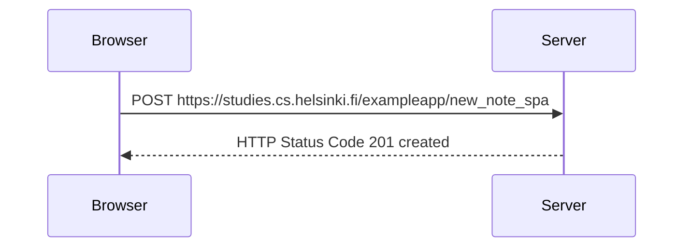

Course: Full Stack Open  

Part: 0

Exercise: 0.5

Objective: Single Page App Diagram

Diagram: HTTP Request Sequence 

```mermaid 

sequenceDiagram
  Browser->>Server: POST https://studies.cs.helsinki.fi/exampleapp/new_note_spa
  Server-->>Browser: HTTP Status Code 201 created
  
```

